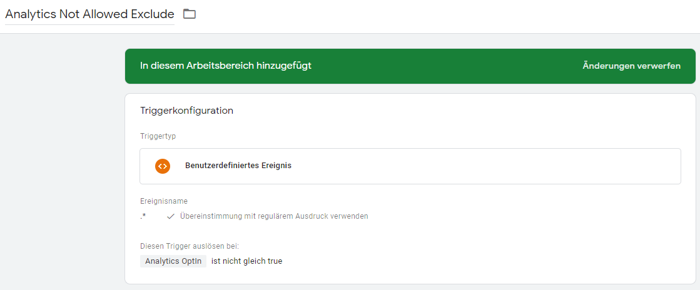
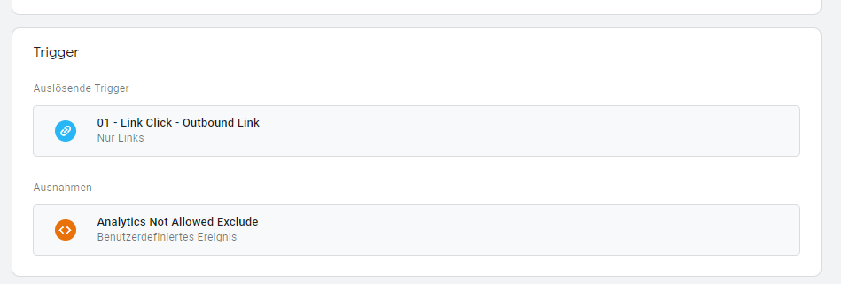

# Borlabs Cookie Configuration

An extensive, multilingual configuration for [Borlabs Cookie](https://de.borlabs.io/borlabs-cookie/).
Obviously an active, valid license is needed for this to work.

✅ Multilingual: English and German translations  
✅ Many services configured (Google Analytics, Google Tag Manger, Facebook Pixel, LiveChat, Hotjar,...)  
✅ Configured to be used with [Google Tag Manager](https://de.borlabs.io/kb/google-tag-manager-nutzen/
)  
✅ Importable and configurable for your needs  

When configuring Borlabs Cookie for multiple languages, it's kind of messy to manually duplicate all cookies/groups and delete their descriptions so the default texts get generated. Therefore when importing on of these files you get all default cookies in both (german + englisch) languages.

## How to use
1. Install & activate [Borlabs Cookie](https://de.borlabs.io/borlabs-cookie/)
2. Download the repo as zip
3. Go to "Borlabs Cookie" > "Import & Export" and copy the coresponding files into the fields.
4. For Multilingual: Import EN files when english language is active in backend. Then switch to german language and import the DE files.

## Configurations / Files
There are multiple examples/files which you can use.

### Default

All services are setup as default: Tracking IDs etc. directly input and scripts included directly by Borlabs Cookie.

### Using via Google Tag Manager

In many projects all tracking is done via Google Tag Manager. So Borlabs Cookie does not really include tracking scripts but merely fires a custom event to be consumed in Tag Manager.
In Tag Manager you trigger tags on these events or check for custom dataLayer variables which reflect the optin status.

Borlabs has some good documentation about using Tag Manager this way: [https://de.borlabs.io/kb/google-tag-manager-nutzen/](https://de.borlabs.io/kb/google-tag-manager-nutzen/).
Additionally to the custom event shown in the documentation my configuration also sets a `optIn` variable (eg `googleAnalyticsOptIn`).
You can check for this variable on custom triggers (eg on form submits) and only fire tags if the variable is true.

I've written more about how to setup Tag Manager this way below, at the moment it's available in German only:

#### How to set up Google Tag Manager

Für jeden Service der über den Tag Manager eingebunden wird (zB Google Analytics, Facebook, Adwords) muss ein eigener Cookie in Borlabs angelegt werden. Im “Opt-In Code” Feld bei der Konfiguration muss dann folgender Code eingegeben werden:
```js
<script>
window.dataLayer = window.dataLayer || [];
  window.dataLayer.push({
    event: '%%EVENT_NAME%%',
	%%VARIABLE_NAME%%: true
  });
</script>
```
Dabei müssen folgende zwei Werte angegeben werden:
%%EVENT_NAME%%: Der Name des custom Events das im Tag-Manager getriggert wird, jedesmal wenn die Seite geladen wird falls der Nutzer die Cookies des Services akzeptiert hat.
%%VARIABLE_NAME%%: Der Name der custom Variable die zum Tag-Manager gepusht wird. Diese Variable kann immer auf true überprüft werden um festzustellen ob der Cookie vom Nutzer erlaubt ist.
Je Service müssen eindeutige, einzigartige Namen verwendet werden - es empfiehlt sich eine ähnliche Struktur zu verwenden - also zB Event- & Variable-Name “optInGoogleAnalytics”. Variablen-Namen müssen ohne Leerzeichen/Sonderzeichen geschrieben werden (oder in Anführungszeichen gesetzt werden).

Das Event kann im Tag-Manager dann als benutzerdefinierte Datenschicht-Ereignis angelegt werden. Die Variable kann als benutzerdefinierte Datenschicht-Variable angelegt werden.

Tags die beim Laden der Seite ausgeführt werden (zB Analytics Base PageView) müssen so konfiguriert werden, dass sie nur bei dem erstellten Event ausgeführt werden (dieses lädt immer beim Laden der Seite, falls der Nutzer die Cookies aktiviert hat).

Tags die bei anderen Triggern (zB Klicken,...) gefeuert werden müssen so konfiguriert werden, dass sie nicht ausgeführt werden, wenn die benutzerdefinierte Variable einen nicht true ist.
Das lässt sich am besten konfigurieren, in dem man einen neuen Trigger namens “Analytics Not Allowed Exclude” vom Triggertyp “Benutzerdefiniertes Ereignis” - als Ereignisname eine Wildcard erstellt und darunter definiert, dass dieser Trigger nur ausgeführt werden soll wenn die benutzerdefinierte Variable “nicht gleich true ist”. Diesen Trigger kann man dann bei den Tags als Ausnahme hinzufügen.




Für Google Analytics wurde die oben empfohlene Konfiguration im Tag-Manager in einem “Website Relaunch” Workspace beispielhaft angelegt.
In Borlabs müssen noch alle Cookies so konfiguriert werden.


## More Information
Have a look at [Borlabs Documentation](https://de.borlabs.io/kbtopic/borlabs-cookie/).

Thanks to Borlabs great work - go and buy a license, imho the best privacy/cookie plugin for WordPress.
